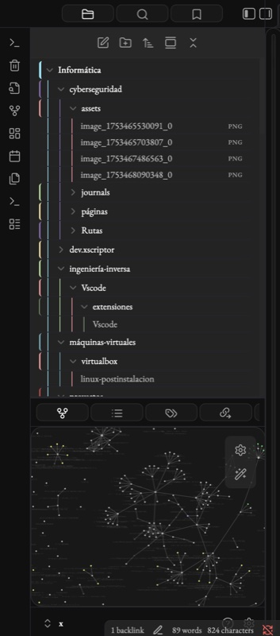
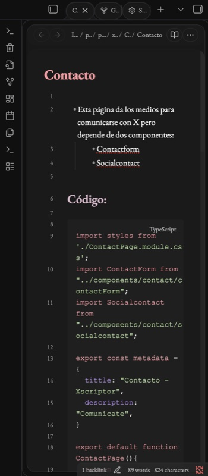
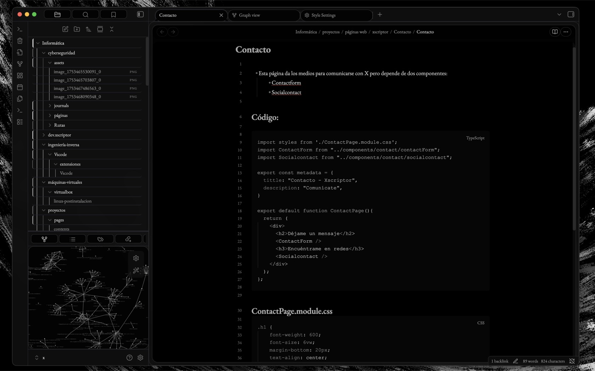
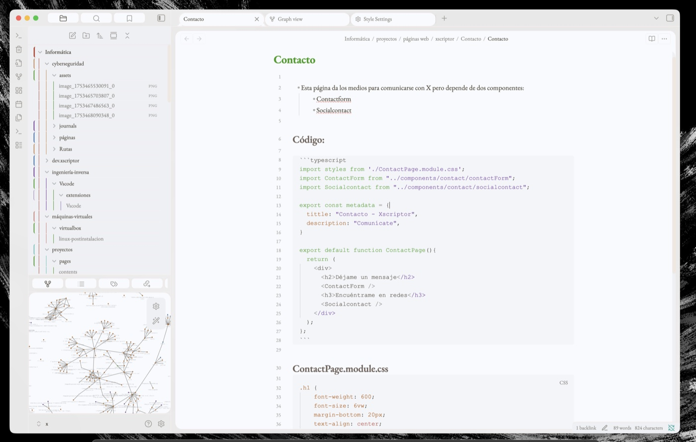
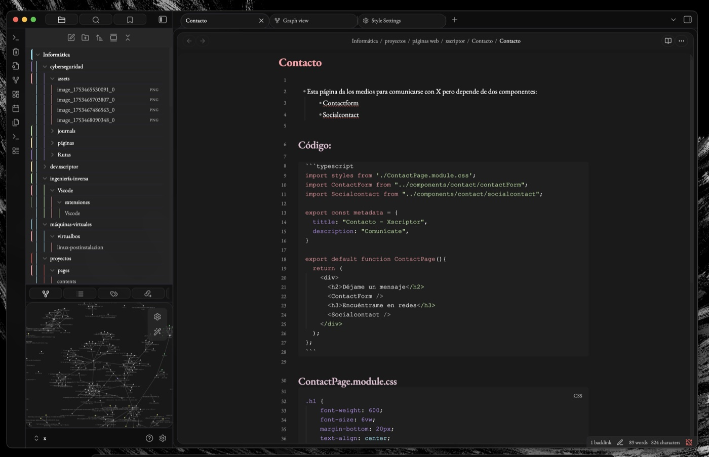
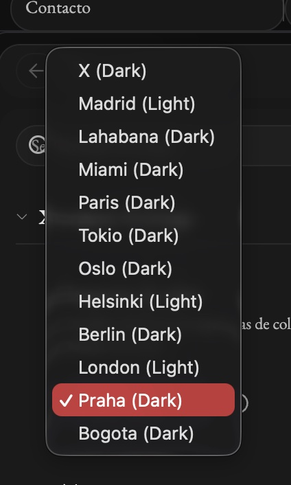

# Xscriptor

An elegant Obsidian theme for coders and writers with beautiful EB Garamond typography and 12 built-in color schemes.

## Features

- EB Garamond typography (regular and italic, weight 400-700)
- 12 color schemes switchable via Style Settings
- Light & dark palettes per scheme
- Subtle transparency and frosted-glass effects
- Syntax highlighting with per-language code block tints
- Folder color borders adapting to the active scheme
- Graph View colors matching the active palette
- Style Settings integration for fine-grained customization

## Installation

- **From Obsidian**: Settings > Appearance > Community Themes > Search **Xscriptor**
- **Manual**: copy these files into `.obsidian/themes/Xscriptor/` and select the theme in Settings > Appearance

### Required plugin
Install [Style Settings](https://github.com/mgmeyers/obsidian-style-settings) to access the scheme selector and all customization options.

## Previews

### Mobile

  
  

#### Old Previews

  
  
  
  

### Desktop

  
  
  

#### Old Previews

  
  

### Selector

## Colors

Following the X color convention

  
  
  
  
  
  

  
  
  
  
  
  

## Info

- [MIT License](LICENSE)
- [Report Issues](https://github.com/xscriptor/obsidian/issues)

Typography: EB Garamond — licensed under SIL Open Font License 1.1.

<h2>X</h2>

 & 

 & 

